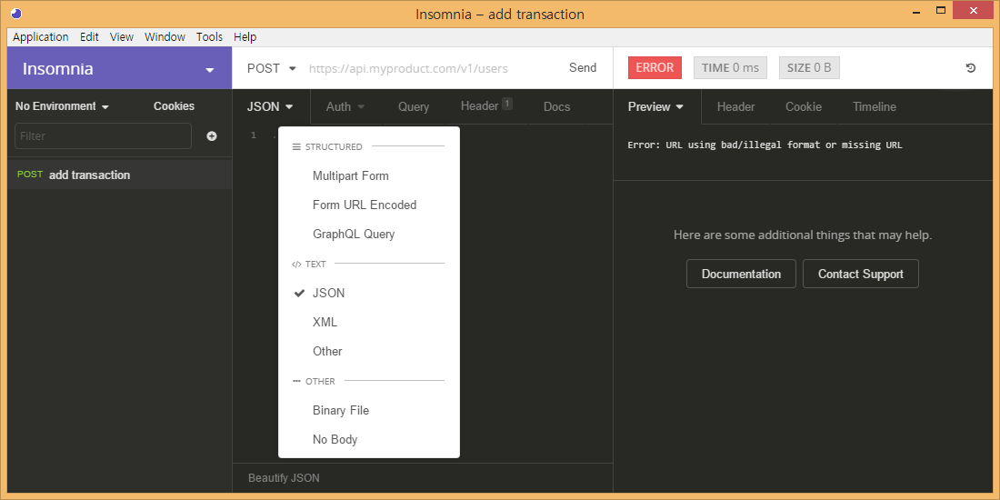
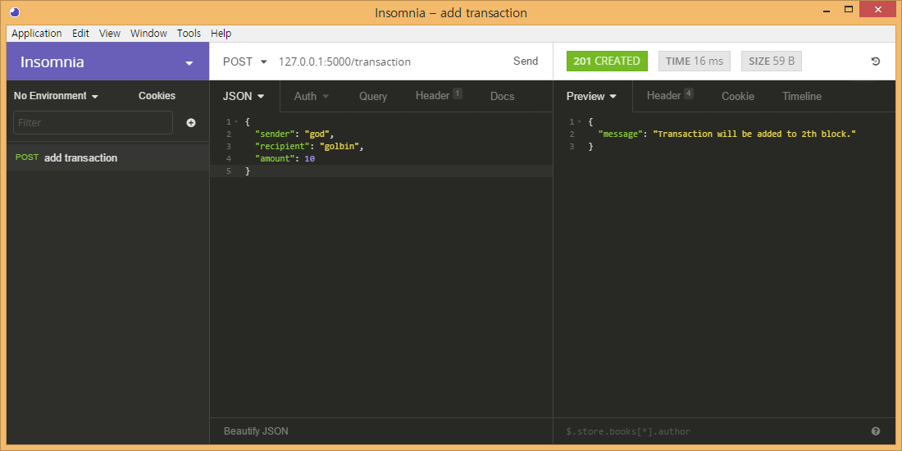
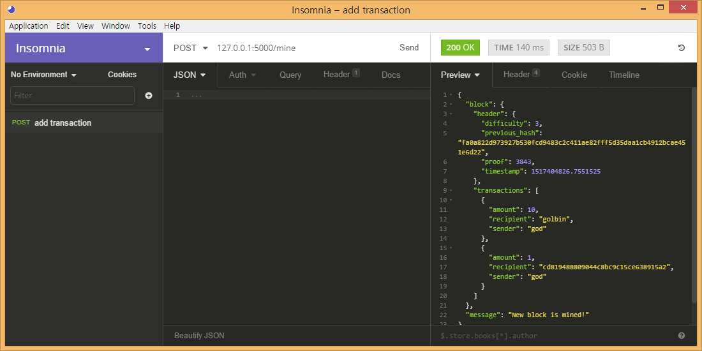
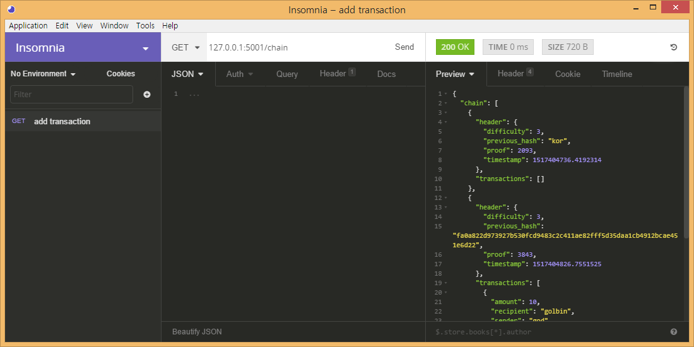

# simple_coin

이것은 [g-coin](https://github.com/golbin/g-coin)을 참조하여 만들었습니다. 해당 코드는 블록체인을 쉽게 이해하기 위해서 만들어졌으며, 시중에 있는 블록체인과 약간 다를 수 있습니다.

## 모듈
- config : 초기 아이디, 해시값, mining에 사용하는 AMOUNT_OF_REWARD와 DIFFICULTY와 PROOF_DIGITS 정보를 저장하고 있습니다.
- transaction : 누가 누구에게 얼마를 보냈는지에 대한 정보를 저장합니다.
- book : 누가 얼마(+ 혹은 -)를 보냈는지를 저장하는 account와 계정의 정보를 바탕으로 거래가 가능한지 판단하고, 실제 거래를 진행하는 book클래스로 이루어져 있습니다.
- block : BlockHeader와 Block으로 구성되며 BlockHeader에는 이전 해시값, timestamp, 유효성 검사를 위한 값이 저장되며, Block에는 transaction의 정보와 header정보가 저장됩니다.
- blockchain : 주로 block을 생성하고 해당 값을 저장합니다.
- miner : 마이닝 과정을 수행합니다(해시값 구하기, 해시구한 노드에게 보상 수여, 새로운 블록 추가).
- node : 여러 node의 정보(address, port)를 저장하고, 일치(consensus)를 확인할 때 사용합니다.
- proof : 수정된 블록이 있는지 확인하기 위하여 사용합니다.

### Insomnia 사용하여 실습하기
- 다운로드
	- [Insomnia](https://insomnia.rest/)에서 다운로드

- 프로그램 실행
```bash
python app.py --port 5000
```

- 형식 변경(body->json)




- 연결 확인( **GET** `/transction`  )


- 거래 추가( **POST** `/transction` , {"sender": "god", "recipient": "golbin", "amount": 10} )




- 마이닝( **POST** `/mine` )




- 새로은 프로그램 실행
```bash
python app.py --port 5001
```

- 노드 추가( **POST** `/node`, {"address": "127.0.0.1:5000"} ) - 5001번 포트에서 실행


- 총의( **POST** `/consensus` ) - 5001번 포트에서 실행


- 체인 확인( **GET** `/chain` ) - 5001번 포트에서 실행




## 부족한 점(g-coin 참고).
- [ ] Merkle root implementation
- [ ] Check balance in transactions in next blocks
- [ ] Fix balance of genesis account
- [ ] Broadcast transactions
- [ ] Use DB

## References
- http://ecomunsing.com/build-your-own-blockchain
- https://qiita.com/hidehiro98/items/841ece65d896aeaa8a2a
- https://github.com/golbin/g-coin
